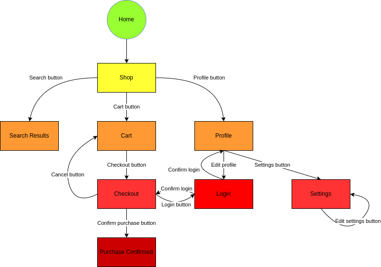

# BoilerStore (DO NOT REVIEW)

In this project, we aim to build BoilerStore: an asset store for indie games, designed by game devs for game devs. The store will offer a wide range of assets, from 3D models to music and more.

Boilerstore will offer a unique approach to asset searching. Our search engine will provide users with the assets they are looking for based on their inputs. Additionally, it will list assets that might help users finish their game based on the kind of game they are making.

## Navigation


## UI Design
You can view our page and interaction designs in Figma [here](https://www.figma.com/file/0VzORJzqKJ0QuVIZ8dZElY/Web?type=design&node-id=0%3A1&t=3D4Uz93yfZ2p1mte-1). We are constantly iterating on different ideas and designs to see what works best, so the UI might change over time.

## HTML5 + CSS3 Mockup
We created a basic HTML + CSS mockup of some pages to serve as a guide and practice. You can find the mockup in the "/mockup/" folder of this repository. As of the last update, these screens are not responsive and are intended for desktop browsers.

The mockup is structured as follows:

    mockup
    | index.html
    | other pages (.html)
    | css (CSS style sheets)
    | dep (dependencies and fonts)
    | img (images)

## Design Principles
Since we aim to promote artistic expression, our UI design was made around the idea of "creativity". We use the following elements to express this mood:

- Smooth gradients
- Round and sharp corners combined
- Slight angles
- Non-conformant differently sized boxes
- Etc.

## Requirements
The following requirements must be met:

- Users must be able to search assets based on name, category, price range, etc.
- Users must be able to search suggested asset bundles based on game genre, target public, etc.
- Users must be able to create asset bundles.
- Users must be able to buy assets and asset bundles.

## Comments About the Code
No meaningful comments can be made at this time since we are still in the design phase.

## Test Plan
To be created.

## Test Results
To be determined. At this point, we have little knowledge about testing frameworks. So when it comes to testing, we can only assume that we are going to pass it.

## Build Procedures
Install nvm:
Linux and MacOS
```
wget -qO- https://raw.githubusercontent.com/nvm-sh/nvm/v0.39.3/install.sh | bash
```
Windows
```
https://github.com/coreybutler/nvm-windows/releases
```

Then install node using nvm:
```
nvm install node
```

Now clone our repository and install node modules
```
git clone https://github.com/KrulesExGamer/BoilerStore
cd BoilerStore/boilerstore-frontend/
npm i
```

Now you only need to start the server and it should be up and running:
```
npm start
```

## Problems
We encountered issues when trying to centralize a div... several times :( . 
Actually, we still did not solve them all... But you know what they say: adapt, improvise, overcome!

## Comments
Hello there!
